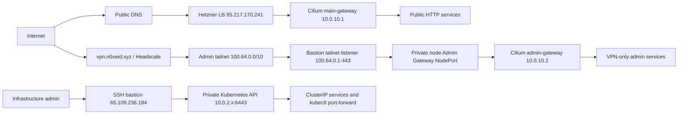

# Production Access, Credentials, and Service Exposure

This guide is the operator entry point for the deployed
`n0xeid-medium-optimized-cx` platform. It explains what access must be issued,
where credentials are stored, how to reach Kubernetes and the VPN, and which
services are public, VPN-only, or cluster-only.

The live-state details in this document were verified on **2026-08-03**. Run
the discovery commands in [Recheck the live exposure](#recheck-the-live-exposure)
after a Gateway, DNS, profile, or application change. Configuration and live
state can differ; live Gateway attachment is authoritative for current HTTP
exposure.

## Security rules

- Never commit `.env`, `.platform-secrets.yml`, a Vault init file, a
  kubeconfig, an age identity, a private SSH key, a Headscale pre-authentication
  key, or a decoded Kubernetes Secret.
- Transfer root-of-trust material through an approved password manager or
  another authenticated out-of-band channel. Do not send it in GitLab issues,
  chat, email, or CI variables without an approved secret-delivery workflow.
- The controller kubeconfig is currently `kubernetes-admin` and can perform
  every action in every namespace. It is an infrastructure-admin credential,
  not a general developer credential.
- Use named GitLab accounts, two-factor authentication, and scoped personal or
  project access tokens for daily work. Do not use GitLab `root` for routine
  Git operations.
- Vault's stored root token is a break-glass/bootstrap credential. Do not copy
  it into Kubernetes Secrets, scripts, shell history, or command arguments.
- Decode a secret only in a trusted terminal. Clear the terminal scrollback and
  unset any temporary shell variable when finished.

## Access architecture



The Kubernetes nodes have private addresses only. The API is not published to
the Internet. The local controller reaches it through a resilient SSH tunnel
to the bastion. HTTP exposure is determined by the Gateway to which an
`HTTPRoute` is attached:

- `main-gateway` means public through the Hetzner load balancer.
- `admin-gateway` means private network or Headscale VPN only.
- no Gateway route normally means cluster-only.

`admin-gateway` is named for its purpose: it is the ingress boundary for
administration services. It is not a Kubernetes administrator account and it
does not itself grant authorization. It has a separate Service, private VIP,
listener, route set, and Cilium policy from `main-gateway`. This lets the same
Gateway API and certificate automation serve sensitive UIs without attaching
their routes to the Internet-facing load balancer. Applications still need
their own login and RBAC when they support them; VPN access is only the first
boundary.

Public wildcard DNS is not proof that an application is public. A private-only
hostname can resolve to `95.217.170.241` from the Internet and return the
Gateway's `404`; the application is still not attached to the public Gateway.

### Known access gaps and hardening work

- The VPN DNS and bastion-to-admin-Gateway path are live, but the final
  workstation test must still be performed when the first human client is
  enrolled. The live tailnet currently contains only the bastion router.
- The only controller kubeconfig is a shared-style `kubernetes-admin`
  credential. Per-person OIDC/RBAC onboarding is not implemented.
- GitLab SSH clone traffic is not published. HTTPS is the supported operator
  clone path today.
- Strict application-layer TLS is not universal inside the cluster. PostgreSQL
  and MongoDB are now enforced TLS-only. Fun pre-production and production use
  Dragonfly's verified TLS listener, while other Dragonfly consumers and many
  Gateway-to-Service and telemetry/storage protocols remain HTTP or clear TCP.
  Cilium WireGuard still encrypts cross-node traffic. See
  [Service communication and encryption](#service-communication-and-encryption).

## Current production access matrix

### Public endpoints

| Service                 | Endpoint                                                                                                                                 | Notes                                                                                                    |
| ----------------------- | ---------------------------------------------------------------------------------------------------------------------------------------- | -------------------------------------------------------------------------------------------------------- |
| Headscale control plane | `https://vpn.n0xeid.xyz`                                                                                                                 | Public enrollment endpoint; a one-use key is still required.                                             |
| GitLab Web/API          | `https://git.n0xeid.xyz`                                                                                                                 | Canonical public hostname. Public self-registration is disabled.                                         |
| GitLab Registry         | `registry.n0xeid.xyz`                                                                                                                    | Public registry endpoint; `/v2/` returns `401` until authenticated, which is expected.                   |
| SeaweedFS S3 API        | `https://s3.n0xeid.xyz`                                                                                                                  | Public API, authenticated with S3 access and secret keys. The console is not public.                     |
| Postal tracking         | `https://track.n0xeid.xyz`                                                                                                               | Public tracking endpoint.                                                                                |
| Postal SMTP             | `mailout.n0xeid.xyz`                                                                                                                     | Public mail host at `65.109.247.139`; configured SMTP/submission ports are `25` and `587`.               |
| Nx protected cache      | `https://nx-cache.n0xeid.xyz`                                                                                                            | Token-authenticated; not an interactive admin UI.                                                        |
| Nx development cache    | `https://nx-cache-dev.n0xeid.xyz`                                                                                                        | Token-authenticated development tier.                                                                    |
| Umami ingest            | `https://umami.n0xeid.xyz/script.js` and `/api/send`                                                                                     | Only these ingest paths are public; the dashboard route is private.                                      |
| Social Agents           | `social-agents.n0xeid.xyz`, `social-agents.pp.n0xeid.xyz`                                                                                | Public application routes.                                                                               |
| FunFiesta S3            | `https://s3.funfiesta.games`                                                                                                             | Public S3 route.                                                                                         |
| UNO and Durak           | root plus `admin`, `api`, `bot`, and `backend` subdomains under `uno.funfiesta.games`, `durak.funfiesta.games`, and their `.pp` variants | These are currently attached to `main-gateway`. Application authentication is owned by each application. |

The `gitlab.n0xeid.xyz` Web UI is a private compatibility alias, not the public
canonical GitLab URL. Its `/jwt/auth` path is publicly routed only so registry
authentication can complete. Use `git.n0xeid.xyz` in clones, remotes, webhooks,
and normal GitLab API calls.

### VPN/private HTTP endpoints

| Service                    | Endpoint                          | Credential or boundary                                                                         |
| -------------------------- | --------------------------------- | ---------------------------------------------------------------------------------------------- |
| Argo CD                    | `https://argocd.n0xeid.xyz`       | Local `admin` account; retrieve the bootstrap password as shown below.                         |
| Grafana                    | `https://grafana.n0xeid.xyz`      | Username and password are in encrypted platform state and the `monitoring/grafana` Secret.     |
| Alertmanager               | `https://alertmanager.n0xeid.xyz` | VPN is the primary access boundary; no separate UI password is deployed.                       |
| Vault                      | `https://vault.n0xeid.xyz`        | Use an approved Vault identity; stored root token is break-glass only.                         |
| Coroot                     | `https://coroot.n0xeid.xyz`       | VPN is the primary access boundary; no separate UI password is declared by this deployment.    |
| Metabase                   | `https://metabase.n0xeid.xyz`     | Accounts are managed inside Metabase; no recoverable UI password is generated by the platform. |
| Umami dashboard            | `https://umami.n0xeid.xyz`        | `admin` bootstrap password is in `umami/umami-runtime`; only ingest paths are public.          |
| SeaweedFS console          | `https://seaweedfs.n0xeid.xyz`    | VPN boundary; use only for storage administration.                                             |
| GitLab compatibility alias | `https://gitlab.n0xeid.xyz`       | Private alias of the GitLab webservice.                                                        |
| GitLab KAS                 | `https://kas.n0xeid.xyz`          | Agent endpoint on the private Gateway.                                                         |
| Registry private path      | `https://registry.n0xeid.xyz`     | The registry is also attached to the public Gateway.                                           |
| Postal Web                 | `https://mail.n0xeid.xyz`         | Administrator UI; SMTP and tracking have separate public paths.                                |

## Service communication and encryption

The short answer is: services use private Kubernetes networking, but not every
internal connection uses application-layer TLS. The deployment uses several
security layers instead of treating TLS as the only control.

| Path                                                                                                 | Network path                                                                                                       | Encryption and enforcement                                                                                                                                                                                                             |
| ---------------------------------------------------------------------------------------------------- | ------------------------------------------------------------------------------------------------------------------ | -------------------------------------------------------------------------------------------------------------------------------------------------------------------------------------------------------------------------------------- |
| Public HTTPS application                                                                             | Client -> Hetzner LB -> Gateway NodePort -> `main-gateway` -> Service                                              | Browser TLS remains encrypted to Cilium Envoy, where the wildcard certificate terminates. The backend hop is normally HTTP.                                                                                                            |
| Private administration UI                                                                            | VPN client -> WireGuard tailnet -> `100.64.0.1:443` HAProxy -> private node NodePort -> `admin-gateway` -> Service | HAProxy uses TCP pass-through, so browser TLS terminates only at Cilium Envoy. The admin Gateway Cilium policy allows private/tailnet sources; the backend hop is normally HTTP.                                                       |
| Kubernetes API                                                                                       | Workstation -> SSH tunnel through bastion -> private control plane `:6443`                                         | SSH protects the tunnel and the Kubernetes API also uses TLS client/server authentication.                                                                                                                                             |
| Pod on one node to pod on another                                                                    | Cilium/VXLAN across the Hetzner private network                                                                    | Cilium WireGuard encrypts node and pod traffic. Live status shows `cilium_wg0` with eight peers and node encryption enabled.                                                                                                           |
| Pod to pod on the same node                                                                          | Local Cilium datapath                                                                                              | No cross-node WireGuard hop; NetworkPolicy/CiliumNetworkPolicy and service authentication remain important.                                                                                                                            |
| Vault API and Raft peers                                                                             | ClusterIP/headless Services                                                                                        | Vault uses its internal CA and HTTPS (`tls_disable = 0`), including HTTPS Raft peer discovery.                                                                                                                                         |
| PostgreSQL                                                                                           | Private ClusterIP/PgBouncer                                                                                        | `spec.tlsOnly=true`; the effective remote client rules are `hostssl` plus explicit plaintext `reject`. The verified client canary negotiated TLS 1.3 and `sslmode=disable` was rejected on 2026-08-03.                                 |
| MongoDB                                                                                              | Private ClusterIP                                                                                                  | Percona generation 15 is `ready 3/3` with `requireTLS`, `allowInvalidCertificates=false`, and user-provided certificate management. The 2026-08-03 verified hostname/password canary passed and plaintext was rejected.                   |
| Dragonfly                                                                                            | Private ClusterIP                                                                                                  | Fun pre-production and production use the verified `rediss://dragonfly-tls:6380` listener and combined CA. Port `6379` remains only as a compatibility path until all other effective client URIs have moved.                           |
| ClickHouse, Loki, VictoriaMetrics, OpenTelemetry, SeaweedFS internals, and most application backends | Private ClusterIP Services                                                                                         | Commonly HTTP, gRPC, or database TCP without per-service TLS. They rely on private addressing, Kubernetes/Cilium policies, credentials, and Cilium WireGuard for cross-node encryption while their application-TLS phases remain open. |

There are currently no `BackendTLSPolicy` objects. Consequently, HTTPS at a
Gateway does not imply HTTPS from that Gateway to its backend. This is not the
same as sending plaintext over the public Internet: backend Services are
cluster-private, 146 Kubernetes NetworkPolicies and 132 CiliumNetworkPolicies
are present, and live Cilium reports WireGuard encryption enabled with node
encryption. Still, workload TLS or mTLS should be added for the highest-value
east-west paths where identity and encryption must remain end to end. The
ordered gates, canaries, and rollback fields are maintained in
[East-West TLS Migration](EAST_WEST_TLS_MIGRATION.md).

### Cluster-only services

PostgreSQL, MongoDB, Dragonfly, VictoriaMetrics, Loki, OpenTelemetry,
ClickHouse, GitLab's internal components, Argo CD Redis/repository server,
Vault Raft peers, SeaweedFS filer/master/volume services, and application
databases are ClusterIP services. Reach them from a workload, through an
approved `kubectl port-forward`, or through a purpose-built private service.
Do not create ad-hoc public `LoadBalancer`, `NodePort`, Ingress, or Gateway
routes for them.

GitLab SSH is not currently published by a `NodePort`, `TCPRoute`, or public
load balancer. Use HTTPS remotes for operator work unless a reviewed GitLab SSH
exposure is added.

## What a new operator must receive

There are two distinct onboarding levels.

### Service user

A developer or product operator normally needs only:

1. A named GitLab account created by a GitLab administrator.
2. Two-factor authentication and a least-privilege GitLab personal access
   token, created by that user in GitLab.
3. A Headscale identity/enrollment when access to private UIs is required.
4. Service-native membership for Argo CD, Grafana, Metabase, or application
   consoles as required by the person's role.

A service user must not receive the cluster-admin kubeconfig, Vault root token,
Ansible Vault password, infrastructure provider token, or shared SSH private
key.

### Infrastructure administrator

An infrastructure administrator additionally needs the following, delivered
out of band by the current platform owner:

| Item                                                                   | Why it is required                                               | Current local location                                                                   |
| ---------------------------------------------------------------------- | ---------------------------------------------------------------- | ---------------------------------------------------------------------------------------- |
| Personal SSH private key whose public key is authorized on the bastion | Starts the API tunnel and permits audited bastion administration | Normally `~/.ssh/id_ed25519`; do not copy another person's private key.                  |
| Source IP allowlist entry                                              | The Hetzner firewall rejects world-open SSH                      | `network.ssh_source_ips` in the active platform config.                                  |
| Protected controller state                                             | Contains kubeconfig, host trust, config, and facts               | `.campaign-state/n0xeid-medium-optimized-cx/controller/`                                 |
| Encrypted platform secrets                                             | Recovery seed for generated service credentials                  | `.campaign-state/n0xeid-medium-optimized-cx/.platform-secrets.yml`                       |
| Encrypted Vault init file                                              | Recovery/unseal material and break-glass root token              | `.campaign-state/n0xeid-medium-optimized-cx/.vault-init-n0xeid-medium-optimized-cx.json` |
| Ansible Vault password file                                            | Decrypts the preceding two encrypted files                       | Set by `ANSIBLE_VAULT_PASSWORD_FILE`; stored separately from the repository.             |
| Backup age identity                                                    | Decrypts cluster recovery bundles                                | Set by `CLUSTER_BACKUP_AGE_IDENTITY`; stored separately from the Ansible Vault password. |
| Provider/DR credentials required by the duty                           | Provisioning, DNS, alerts, and disaster recovery                 | Mode-`0600`, gitignored `.env` or the approved external secret manager.                  |

The repository does not currently automate individual human Kubernetes
identities or least-privilege kubeconfigs. Copying the controller kubeconfig
grants cluster-admin. Add a reviewed OIDC/RBAC onboarding path before extending
Kubernetes access beyond the infrastructure-admin group.

## Prepare an infrastructure-admin workstation

Install Git, OpenSSH, `kubectl`, Helm, Python/Ansible dependencies, `jq`, `yq`,
the Tailscale client, and optionally the `argocd` and `vault` CLIs. Use a
`kubectl` client compatible with Kubernetes `v1.35.4`.

From the repository root:

```bash
export PROJECT=n0xeid-medium-optimized-cx
export STATE_ROOT="$PWD/.campaign-state/$PROJECT"
export CONTROLLER_ROOT="$STATE_ROOT/controller"
export KUBECONFIG="$CONTROLLER_ROOT/home/.kube/config"
export PLATFORM_SECRETS="$STATE_ROOT/.platform-secrets.yml"
export VAULT_INIT="$STATE_ROOT/.vault-init-$PROJECT.json"
export SSH_KNOWN_HOSTS="$CONTROLLER_ROOT/home/.ssh/known_hosts-$PROJECT"
export ANSIBLE_VAULT_PASSWORD_FILE=/secure/path/to/ansible-vault-password

chmod 600 "$KUBECONFIG" "$PLATFORM_SECRETS" "$VAULT_INIT" \
  "$SSH_KNOWN_HOSTS" "$ANSIBLE_VAULT_PASSWORD_FILE"
test -s "$KUBECONFIG"
test -s "$PLATFORM_SECRETS"
test -s "$VAULT_INIT"
```

Do not `source .env`. Values such as an SSH key name can contain spaces. The
platform scripts use their own dotenv loader. Export an individual value or
let the supported script load `.env`.

Compare the protected file with `.env.example`. Depending on enabled features,
the external roots of trust are `HCLOUD_TOKEN`, `GCORE_API_KEY`,
`GITHUB_TOKEN`, `BACKUP_DR_*`, `CLUSTER_BACKUP_AGE_*`,
`ANSIBLE_VAULT_PASSWORD_FILE`, `ALERT_*`, and any one-time
`GITLAB_*_RUNNER_TOKEN`. Provider tokens should be issued to named operators or
automation identities with the narrowest available permissions; do not share a
single personal token when the provider supports separate identities.

## Connect to Kubernetes

The controller kubeconfig points to `https://127.0.0.1:16443`. A local tunnel
must be running before `kubectl` can use it.

### Start the tunnel in a terminal

Load the authorized key into the SSH agent, then run the repository's failover
supervisor in a dedicated terminal:

```bash
ssh-add ~/.ssh/id_ed25519

./scripts/kube-api-tunnel-supervisor.sh \
  --bastion 65.109.236.184 \
  --target 10.0.2.2 \
  --target 10.0.2.3 \
  --target 10.0.2.4 \
  --kubeconfig "$KUBECONFIG" \
  --known-hosts-file "$SSH_KNOWN_HOSTS" \
  --local-port 16443
```

The supervisor fails over among all three control-plane nodes and keeps the
local API listener stable. Stop it with `Ctrl-C` when the session ends.

The established macOS controller instead runs the generated LaunchAgent
`xyz.n0xeid.kube-api-tunnel-medium-optimized`. Its plist contains absolute
paths and must be regenerated or reviewed before copying it to another user:

```bash
launchctl print \
  "gui/$(id -u)/xyz.n0xeid.kube-api-tunnel-medium-optimized"
```

### Verify access before doing work

```bash
kubectl get --raw=/readyz
kubectl cluster-info
kubectl get nodes -o wide
kubectl auth can-i '*' '*' --all-namespaces
```

The last command currently returns `yes` for the controller kubeconfig. Treat
that as a warning about privilege, not merely a connectivity check.

For direct bastion diagnostics:

```bash
ssh \
  -o StrictHostKeyChecking=yes \
  -o UserKnownHostsFile="$SSH_KNOWN_HOSTS" \
  root@65.109.236.184
```

## Connect to the Headscale VPN

The bastion hosts Headscale. The live server is healthy and currently has the
`admin` and `dev` users. The `admin` policy can reach the private network;
`dev` has no private-network access by default.

An existing infrastructure administrator creates a separate one-use key on the
bastion. Do not reuse the subnet-router key:

```bash
ADMIN_ID="$(docker exec headscale headscale users list -o json |
  jq -er '.[] | select(.name == "admin") | .id')"

docker exec headscale headscale preauthkeys create \
  --user "$ADMIN_ID" \
  --expiration 1h
```

Immediately use the returned key on the new workstation:

```bash
tailscale up \
  --login-server=https://vpn.n0xeid.xyz \
  --auth-key='<one-use-key>' \
  --accept-routes \
  --accept-dns

tailscale status
```

Never store the one-use key in a shell profile, file, GitLab variable, or
ticket. Confirm the client appears under the intended Headscale user and that
the `10.0.0.0/16` route is accepted.

### VPN private DNS and the admin edge

On 2026-08-02, the managed Headscale record file was reconciled with 13 admin
hostnames. They resolve to the bastion's tailnet-only address `100.64.0.1` for
enrolled clients:

```text
argocd.n0xeid.xyz grafana.n0xeid.xyz alertmanager.n0xeid.xyz
vault.n0xeid.xyz coroot.n0xeid.xyz metabase.n0xeid.xyz
umami.n0xeid.xyz seaweedfs.n0xeid.xyz gitlab.n0xeid.xyz
git.n0xeid.xyz registry.n0xeid.xyz kas.n0xeid.xyz mail.n0xeid.xyz
```

The different address is intentional. The Cilium admin Gateway VIP
`10.0.10.2` is a MetalLB L2 address reachable by cluster nodes, not a routed
address from the bastion. HAProxy therefore listens only on `100.64.0.1:443`
and TCP-passes the original TLS stream to the live admin Gateway NodePort on
the private nodes. Its public-IP listeners remain dedicated to Headscale.

VPN records are declared under `network.vpn.internal_dns.zones`. Cluster
CoreDNS records remain under `network.internal_dns.zones` and can use the
in-cluster VIP. Keeping these maps separate prevents a valid cluster-local
address from being handed to a laptop that cannot route it.

Headscale's literal `dns.nameservers.split` map is still `{}` by design. That
field is for forwarding an entire DNS suffix to a private DNS resolver. This
deployment does not run such a resolver on the tailnet; it publishes a small,
explicit allowlist through `extra_records_path` instead. Therefore an empty
split-forwarder map is not a health or exposure failure as long as the managed
extra records are populated and the client accepts DNS. Add a split resolver
only if dynamic records or whole private zones are required later.

Verification from an enrolled client:

```bash
dig +short argocd.n0xeid.xyz       # expected on VPN: 100.64.0.1
curl -fsS https://argocd.n0xeid.xyz/healthz
curl -fsS https://grafana.n0xeid.xyz/api/health
```

## Retrieve credentials safely

Use the encrypted recovery files as the source for generated platform
credentials and Kubernetes Secrets as runtime copies. Do not decrypt the whole
file into a persistent plaintext file. The same generated bundle is mirrored
under Vault KV-v2 path
`secret/clusters/n0xeid-medium-optimized-cx/platform/generated`; read it only
through an approved non-root Vault identity during normal operation.

List available encrypted platform keys without printing values:

```bash
.venv/bin/ansible-vault view \
  --vault-password-file "$ANSIBLE_VAULT_PASSWORD_FILE" \
  "$PLATFORM_SECRETS" |
  yq 'keys | .[]'
```

Read one approved value in a trusted terminal:

```bash
SECRET_KEY=argocd_admin_password
.venv/bin/ansible-vault view \
  --vault-password-file "$ANSIBLE_VAULT_PASSWORD_FILE" \
  "$PLATFORM_SECRETS" |
  yq -r ".${SECRET_KEY}"
unset SECRET_KEY
```

Do not pipe secrets into `echo`, logs, shell tracing, or commands that place
them in the process list. Prefer an interactive password prompt for service
login.

### Credential inventory

| Service/purpose                       | Username or key                             | Recovery source                                                 | Runtime source                                                                         |
| ------------------------------------- | ------------------------------------------- | --------------------------------------------------------------- | -------------------------------------------------------------------------------------- |
| GitLab bootstrap administrator        | `root`                                      | Service-generated; not in platform secrets                      | `gitlab/gitlab-gitlab-initial-root-password`, key `password`                           |
| Argo CD                               | `admin`                                     | `argocd_admin_password`                                         | `argocd/argocd-initial-admin-secret`, key `password`                                   |
| Grafana                               | `grafana_admin_user`, normally `admin`      | `grafana_admin_user`, `grafana_admin_password`                  | `monitoring/grafana`, keys `admin-user`, `admin-password`                              |
| Vault break-glass                     | `root` token plus recovery/unseal shares    | Encrypted `$VAULT_INIT`                                         | Intentionally not stored in a Kubernetes Secret                                        |
| SeaweedFS S3                          | S3 access/secret key pairs                  | `object_storage_*_access_key` and `object_storage_*_secret_key` | Purpose-specific `object-storage-credentials` Secrets                                  |
| Postal administrator                  | `admin@n0xeid.xyz`                          | `postal_admin_password`                                         | `postal/postal-bootstrap-credentials`, key `admin-password`                            |
| Postal SMTP client                    | purpose-specific                            | Stored as generated/runtime data                                | `postal/postal-bootstrap-credentials`, keys `smtp-credential`, `smtp-credentials.json` |
| Umami bootstrap administrator         | `admin`                                     | Application-owned after bootstrap                               | `umami/umami-runtime`, key `ADMIN_PASSWORD`                                            |
| Metabase UI                           | Named Metabase account                      | Service-native; not in platform secrets                         | No platform-generated UI password; DB/SMTP runtime data is in `analytics/metabase-*`   |
| Coroot/Alertmanager/SeaweedFS console | none deployed                               | VPN is the access boundary                                      | No separate UI credential Secret                                                       |
| Dragonfly                             | Redis-compatible password                   | `dragonfly_password`                                            | `dragonfly/dragonfly-auth`, key `password`                                             |
| Nx caches                             | cache admin/read-only tokens                | Generated application state                                     | `nx-cache/*-runtime`, keys such as `admin-token` and `protected-readonly-token`        |
| PostgreSQL clients                    | one role per consumer                       | Operator/database recovery                                      | `databases/*-pguser-*`; use `uri`, `host`, `port`, `user`, `password`, and CA keys     |
| MongoDB clients                       | one role per consumer                       | Operator/database recovery                                      | `databases/*mongo*` purpose-specific Secrets                                           |
| GitLab Runners                        | `glrt-...` authentication tokens            | `gitlab_runner_token` and dedicated runner variants             | `gitlab/platform-gitlab-runner-auth` and runner-specific Secrets                       |
| Alert delivery                        | Telegram BotFather token and target chat ID | `alert_telegram_bot_token`, `alert_telegram_chat_id`            | Vault generated-credential mirror and `monitoring/alert-secrets`                       |
| External DR                           | access/secret key pair                      | `backup_dr_*` and protected `.env`                              | `velero`/backup purpose-specific Secrets                                               |
| Hetzner provider                      | API token                                   | protected `.env` or external secret manager                     | Only purpose-specific runtime copies such as `monitoring/hetzner-cloud-token`          |

### Bootstrap Telegram alert delivery

The Telegram token and chat ID are intentionally absent until an operator
creates a BotFather bot and selects the destination chat. Store them without
putting either value in shell history or a plaintext file:

```bash
scripts/store-alert-credentials.py \
  --file "$PLATFORM_SECRETS" \
  --vault-password-file "$ANSIBLE_VAULT_PASSWORD_FILE"
```

The helper prompts without echo, validates both values, and atomically rewrites
the mode-`0600` Ansible Vault file. The next governed `secrets` reconciliation
allows only the one-time transition where both Telegram fields in Vault are
empty and both encrypted recovery fields are configured. That update uses
Vault KV-v2 compare-and-set. Any unrelated drift, partial Telegram value, or
later token replacement fails closed and requires an explicit rotation change.

Reconcile `secrets` first, then `alerting`, using the same controller variables
and `scripts/with-encrypted-dr-credentials.py` wrapper used for the normal
platform deployment. Do not pass either Telegram value with `-e` or an
environment variable. Confirm `monitoring/alert-secrets` exists, then send a
controlled test alert and remove it after both firing and resolved messages
arrive.

If a mode-`0600` `.env` already contains `ALERTS_TELEGRAM_BOT_TOKEN`, import it
without placing the token in process arguments. When the bot has exactly one
chat in `getUpdates`, the helper can resolve that chat ID without printing the
token or destination:

```bash
scripts/store-alert-credentials.py \
  --file "$PLATFORM_SECRETS" \
  --vault-password-file "$ANSIBLE_VAULT_PASSWORD_FILE" \
  --env-file .env \
  --discover-chat-id
```

If Telegram returns no chat, send `/start` to the bot or add it to the target
group and run again. If it returns multiple chats, set the intended numeric ID
as `ALERTS_TELEGRAM_CHAT_ID` in `.env`; the helper refuses to guess.

Examples for runtime copies:

```bash
# GitLab one-time bootstrap password
kubectl -n gitlab get secret gitlab-gitlab-initial-root-password \
  -o jsonpath='{.data.password}' | base64 --decode; printf '\n'

# Argo CD one-time bootstrap password
kubectl -n argocd get secret argocd-initial-admin-secret \
  -o jsonpath='{.data.password}' | base64 --decode; printf '\n'

# Grafana username and password
kubectl -n monitoring get secret grafana \
  -o jsonpath='{.data.admin-user}' | base64 --decode; printf '\n'
kubectl -n monitoring get secret grafana \
  -o jsonpath='{.data.admin-password}' | base64 --decode; printf '\n'
```

The Vault init file contains `root_token`, recovery keys, and unseal keys. List
its field names without showing values:

```bash
.venv/bin/ansible-vault view \
  --vault-password-file "$ANSIBLE_VAULT_PASSWORD_FILE" \
  "$VAULT_INIT" |
  jq -r 'keys[]'
```

Retrieve a break-glass token only with incident/change authorization, then use
`vault login` interactively so the token is not present in command arguments.

## Use GitLab

1. Open `https://git.n0xeid.xyz`.
2. Bootstrap only: sign in as `root` with the Kubernetes Secret above.
3. Create a named administrator/user account, require two-factor
   authentication, and stop using `root` for routine work.
4. Create a scoped personal access token under the named account. Give it only
   the scopes and expiry required by the task.
5. Use HTTPS Git remotes because GitLab SSH is not currently exposed.

```bash
git clone https://git.n0xeid.xyz/GROUP/PROJECT.git
git remote set-url origin https://git.n0xeid.xyz/GROUP/PROJECT.git
```

For the registry, create a PAT or deploy token with registry scope and use
standard input so the token is not a command argument:

```bash
read -r -s GITLAB_REGISTRY_TOKEN
printf '%s' "$GITLAB_REGISTRY_TOKEN" |
  docker login registry.n0xeid.xyz \
    --username YOUR_GITLAB_USERNAME \
    --password-stdin
unset GITLAB_REGISTRY_TOKEN
```

Runner authentication tokens are machine credentials. Do not use or rotate
them as human PATs. Follow
[GitLab Runner token bootstrap](GITLAB_RUNNER_BOOTSTRAP.md) for runner recovery.

## Use Argo CD

After connecting to the VPN:

```bash
argocd login argocd.n0xeid.xyz --username admin
argocd app list
argocd app get APPLICATION
```

`argocd login` prompts for the password. Avoid `--password VALUE`, which puts
the secret in the process arguments. The live Argo CD configuration currently
has the local `admin` account enabled and no additional local accounts.

For recovery or diagnosis, use the Kubernetes API tunnel instead:

```bash
kubectl -n argocd port-forward svc/argocd-server 8080:443
# In another terminal:
argocd login localhost:8080 --insecure --username admin
```

Argo CD is configured with scoped AppProjects and repository credentials. Do
not add a repository or broaden a project's source/destination allowlist as an
access workaround.

## Use the other administration services

Use each HTTPS hostname from the matrix while connected to the VPN. With
cluster-admin, a local port-forward is also available for recovery:

```bash
# Grafana: http://127.0.0.1:3000
kubectl -n monitoring port-forward svc/grafana 3000:80

# Vault proxy: http://127.0.0.1:8200
kubectl -n vault port-forward svc/vault-gateway-proxy 8200:8080

# Coroot: http://127.0.0.1:8080
kubectl -n coroot port-forward svc/coroot-coroot 8080:8080

# Metabase: http://127.0.0.1:3001
kubectl -n analytics port-forward svc/metabase 3001:3000

# Umami: http://127.0.0.1:3002
kubectl -n umami port-forward svc/umami 3002:3000

# SeaweedFS S3 API: http://127.0.0.1:8333
kubectl -n storage port-forward svc/seaweedfs-s3 8333:8333

# Postal Web: http://127.0.0.1:5000
kubectl -n postal port-forward svc/postal-web 5000:5000
```

Run one port-forward per terminal and stop it with `Ctrl-C`. A port-forward is
not a substitute for service authorization; Kubernetes access already grants
privileged network reachability.

For a purpose-specific PostgreSQL client, inspect only that consumer's Secret:

```bash
kubectl -n databases get secrets | grep pguser
kubectl -n databases get secret SECRET_NAME -o jsonpath='{.data.uri}' |
  base64 --decode; printf '\n'
```

Do not use the database superuser when a consumer role exists. For S3, use the
purpose-specific key (`gitlab`, `backup`, `observability`, `ci-cache`, and so
on), not the bootstrap/admin key.

## Recheck the live exposure

Run these commands from an active Kubernetes session before publishing an
access statement or onboarding a user:

```bash
# Every HTTP hostname and its attached Gateway
kubectl get httproutes.gateway.networking.k8s.io -A -o json |
  jq -r '.items[] |
    [([.spec.parentRefs[]?.name] | unique | join("+")),
     .metadata.namespace,
     .metadata.name,
     ([.spec.hostnames[]?] | join(","))] | @tsv' |
  sort

# LoadBalancer/NodePort surfaces
kubectl get services -A -o json |
  jq -r '.items[] | select(.spec.type != "ClusterIP") |
    [.metadata.namespace,.metadata.name,.spec.type,
     ([.status.loadBalancer.ingress[]? | (.ip // .hostname)] | join(",")),
     ([.spec.ports[] | ((.name // "") + ":" + (.port|tostring) +
       ":" + ((.nodePort // 0)|tostring))] | join(","))] | @tsv'

# Non-HTTP Gateway routes; currently none are deployed
kubectl get tcproutes.gateway.networking.k8s.io,\
tlsroutes.gateway.networking.k8s.io,\
grpcroutes.gateway.networking.k8s.io -A
```

Verify public behavior from a machine that is not on the VPN and private
behavior from an enrolled VPN client. For authenticated services, `401` or a
login redirect can be the expected healthy result; distinguish that from a
Gateway `404`, DNS failure, or timeout.

Useful platform health checks:

```bash
kubectl get nodes
kubectl get pods -A --field-selector=status.phase!=Running,status.phase!=Succeeded
kubectl get applications.argoproj.io -n argocd
kubectl get externalsecrets.external-secrets.io -A
kubectl get certificates.cert-manager.io -A
```

## Credential rotation and offboarding

1. Disable the person's GitLab account and revoke their PATs, deploy tokens,
   SSH keys, sessions, and registry credentials.
2. Remove their Headscale node and expire any unused pre-authentication keys.
3. Remove their bastion public key and source CIDR through the managed
   infrastructure workflow.
4. Revoke service-native sessions/accounts in Argo CD, Grafana, Metabase, and
   applications.
5. If a shared credential or cluster-admin kubeconfig was disclosed, rotate it
   as an incident; deleting a local copy is not revocation.
6. Rotate in dependency order: external backup/provider access first, then Git,
   registry and runners, databases/service credentials, Vault/ESO integrations,
   and finally human/admin and notification credentials.
7. Verify a fresh backup before rotating recovery-critical material.

See [Vault secret governance](VAULT_SECRET_GOVERNANCE.md),
[security overview](../SECURITY_OVERVIEW.md), and
[the operations runbook](../RUNBOOK.md) for the recovery and change-management
boundaries.
