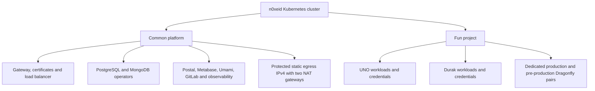

# n0xeid cluster resource ownership

The ownership boundary follows blast radius. Product resources stay with the
product; controllers and services consumed by multiple products stay in the
shared platform.

| Capability | Physical placement | Isolation contract | Owner |
| --- | --- | --- | --- |
| PostgreSQL | Shared HA operator/cluster | Database, owner role, TLS secret, backup policy and network policy per consumer | Common platform |
| MongoDB | Shared three-member replica set | Database and user per product/environment; separate read-only analytics users | Common platform plus product bootstrap |
| Dragonfly | One shared instance for platform services; dedicated two-replica stores in each Fun environment | Credentials, namespace, PVCs and quotas are environment-specific | Common platform / Fun project |
| Postal | Shared transactional transport | SMTP credential per service/environment; sender-domain SPF, DKIM and DMARC | Common platform |
| Metabase | Shared analytics service | Own metadata database and read-only credentials to explicitly registered sources | Common platform |
| Umami | Shared analytics service | Own event database; products submit events and receive no Umami DB credential | Common platform |
| Fun edge | Shared Gateway listener, Fun-owned certificates and routes | `projects/fun/**` contains only Fun hostnames and policies | Common edge / Fun project |
| CI runners | General, image-build and Docker/DinD pools on isolated nodes | Taints, namespaces, quotas, network policy and non-overlapping runner tags | Common platform |

Provider server display names use `n0xeid-cx-*`. Kubernetes kubelet names are
stable node identities and are not rewritten in place. Hetzner CSI volume
display names are reconciled by `playbooks/reconcile_hcloud_volume_names.yml`;
the volume IDs used by Kubernetes remain unchanged.

The static outbound identity is the protected Floating IPv4. Health-checked
failover moves it between two dedicated gateways and rewrites the Hetzner
default route. Products consume that route; they do not own gateways, provider
routes, or Floating IPs.
